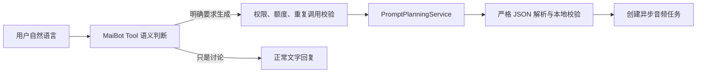
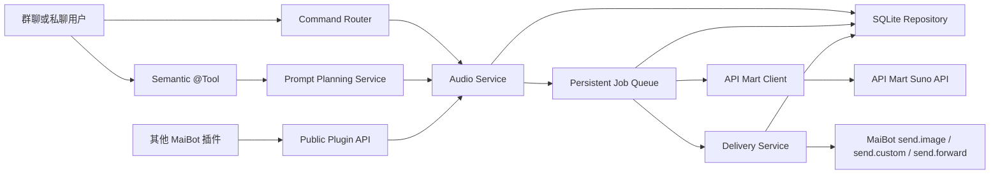
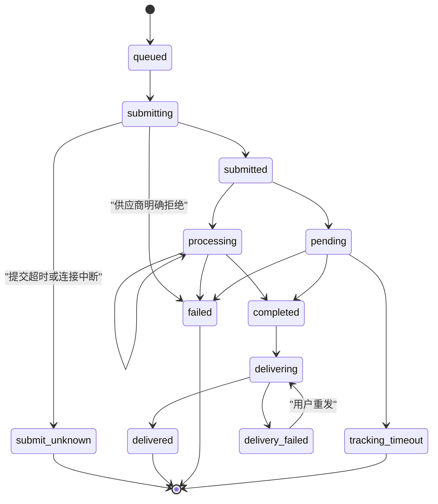

# MaiBot Suno 音频生成插件技术功能文档

> 文档状态：开发前技术方案草案 1.1
> 编写日期：2026-08-08
> 暂定插件名：Suno 音频工坊
> 暂定仓库目录：`plugins/maibot-suno-audio-plugin`
> 暂定插件 ID：`maibot-community.suno-audio-plugin`
> 暂定指令前缀：`/声音`

## 1. 文档目标

本文档定义一个独立 MaiBot 插件，用于通过 API Mart 的 Suno API 在群聊或私聊中生成歌曲、纯音乐、歌词和音效，并管理异步任务、音频结果、历史记录与后续编辑。

本方案遵循以下原则：

1. 不修改 MaiBot 主程序，全部功能在独立插件仓库内实现。
2. 用户必须明确表达生成意图，可以使用指令，也可以使用自然语言；仅讨论音乐、声音或已有作品不得触发付费生成。
3. 生成任务异步执行，命令和公开插件 API 不等待完整生成过程，避免 30 秒 RPC 超时。
4. 所有供应商任务均落库，可在插件重载或 MaiBot 重启后恢复查询。
5. 完整歌曲默认作为文件发送，短音效才可按配置发送为语音消息。
6. API Key 不写入日志、数据库任务快照、错误消息或聊天记录。

## 2. 外部接口事实与设计约束

API Mart Suno 接口使用 Bearer Token 认证。绝大多数生成与编辑接口是异步任务：提交请求后取得 `task_id`，随后查询 `GET /v1/music/tasks/{task_id}`，直到状态变为 `completed` 或 `failed`。官方建议每 3–5 秒轮询一次，音乐生成通常耗时 30–120 秒。

任务完成后，主要结果位于 `data.result.music[]`，单次音乐生成通常返回两首。每首结果可能包含：

- `audio_id`
- `title`
- `duration`
- `lyrics`
- `tags`
- `audio_url`
- `image_url`
- `image_large_url`
- `video_url`

基于已有音轨的操作使用供应商 `task_id` 与 1 开始的 `audio_index` 定位源音轨。

### 2.1 已确认的核心端点

| 功能 | 方法与端点 | 关键参数 | 首期范围 |
|---|---|---|---|
| 查询任务 | `GET /v1/music/tasks/{task_id}` | `task_id` | P0 |
| 生成音乐 | `POST /v1/music/generations` | `version`、`custom`、`instrumental`、`prompt` | P0 |
| 生成歌词 | `POST /v1/music/generations/lyrics` | `prompt`、`lyrics_model` | P0 |
| 生成音效 | `POST /v1/music/generations/sounds` | `prompt`、`version`、`type`、`bpm`、`key` | P0 |
| 标签增强 | `POST /v1/music/generations/upsampleTags` | `tags` | P1 |
| 灵感生成 | `POST /v1/music/generations/inspo` | `audio_urls`、`version`、`tags` | P1 |
| 上传音频 | `POST /v1/music/generations/uploadTask` | `audioFilePath` 公网直链 | P1 |
| 续写延长 | `POST /v1/music/generations/extend` | `task_id`、`audio_index`、`continue_at`、`version` | P1 |
| 风格翻唱 | `POST /v1/music/generations/coverSong` | `task_id`、`audio_index`、`version`、`tags` | P1 |
| 母带与分轨 | 对应 `mastering`、`stems`、`stems-all` 文档 | 源音轨 | P2 |
| 音频编辑 | 裁剪、淡入、淡出、速度、片段替换、拼接 | 源音轨与时间参数 | P2 |
| 衍生产物 | MIDI、歌词时间轴、BPM、MV、WAV | 源音轨 | P2 |

### 2.2 生成音乐参数约束

`POST /v1/music/generations` 的 `version` 必填，可用值以供应商当前文档为准，现有文档列出：`v3.5`、`v4`、`v4.5`、`v4.5+`、`v4.5-all`、`v5`、`v5.5`。

- `custom=false`：灵感模式，`prompt` 表示音乐描述；`title`、`style` 等自定义字段会被供应商静默忽略。
- `custom=true`：自定义模式，`prompt` 表示歌词；可使用 `title`、`style`、`negative_tags`、`auto_lyrics`、`persona_id`、`style_weight`、`weirdness_constraint`、`audio_weight`。
- `instrumental=true`：生成纯音乐；在自定义模式下允许不提供歌词。
- `vocal_gender`：`Male` 或 `Female`，两种模式均可生效。
- 三个权重参数取值范围均为 `0.00`–`1.00`。
- 本端点使用 `style` 字段，不是其他端点常见的 `tags`。

### 2.3 音效参数约束

音效生成支持 `v5` 与 `v5.5`，默认 `v5.5`。`prompt` 必填，官方建议优先使用英文描述。`type` 可取 `one-shot` 或 `loop`；`bpm` 为 `1`–`300`；`key` 仅接受升号表示法及对应小调，例如 `C#`、`C#m`，不接受 `Db`。

## 3. 产品范围

### 3.1 P0：首个可用版本

P0 必须实现：

1. 灵感模式歌曲生成。
2. 纯音乐生成。
3. 自定义标题、风格和歌词的歌曲生成。
4. 歌词生成。
5. 单次音效与循环音效生成。
6. 异步任务队列、进度查询、历史记录与结果重发。
7. 供应商返回的全部音轨保存到数据库。
8. 音频文件、封面、标题、时长、歌词和风格标签发送。
9. 配置页、权限控制、并发限制、冷却时间和每日额度。
10. 插件重载或 MaiBot 重启后恢复未完成任务。
11. 使用 MaiBot `@Tool` 实现自然语言语义识别触发。
12. 使用可配置的 MaiBot 模型任务优化自然语言提示词，并输出严格结构化参数。
13. 面向其他插件的非阻塞公开 API。
14. 完整中文日志、错误分类和测试。

### 3.2 P1：基于音频的再创作

P1 增加：

1. 标签增强。
2. 公网音频导入。
3. 1–4 段公网音频的灵感生成。
4. 歌曲续写与延长。
5. 风格翻唱。
6. 引用群内文件或语音，上传到可公开访问的对象存储后再导入。
7. 任务收藏、别名与预设管理。

其中第 6 项需要额外的对象存储能力。API Mart 的 `uploadTask` 接收的是公网音频直链，并不直接接收 MaiBot 本地文件或 Base64，因此首期不能假设“引用群文件即可上传”。

### 3.3 P2：专业编辑工具

P2 增加母带优化、分轨、添加人声、添加伴奏、添加音轨、提取 Vox、Persona、片段替换、裁剪、淡入淡出、速度调整、拼接、混搭、样本转歌曲、MIDI、歌词时间轴、BPM、MV 和 WAV 导出。

### 3.4 明确不做

- P0 不修改 MaiBot 主程序。
- P0 不实现供应商 Webhook；优先使用可恢复轮询。
- P0 不允许模型在用户没有明确生成请求时自主付费生成；允许 `@Tool` 对明确自然语言请求进行语义识别和参数提取。
- P0 不承诺取消供应商任务或退款；供应商文档未给出取消端点。
- P0 不把完整歌曲强制转换为 QQ 语音。
- P0 不自行提供公开音频托管服务。

## 4. 用户指令设计

### 4.1 基础与帮助

| 指令 | 功能 |
|---|---|
| `/声音` | 发送完整帮助 |
| `/声音 帮助` | 发送完整帮助 |
| `/声音 状态 [任务ID]` | 无参数时查看当前用户最近任务；有参数时查看指定任务 |
| `/声音 历史 [页码]` | 查看当前聊天流中的生成历史 |
| `/声音 结果 <任务ID> [序号]` | 查看任务结果信息；序号默认为全部 |
| `/声音 重发 <任务ID> [序号]` | 重新发送已完成音轨 |

任务 ID 对用户展示插件本地短 ID，例如 `snd_7K3M9P`。供应商 `task_id` 只用于调试和后续 API 调用，不作为主要用户标识。

### 4.2 生成音乐

```text
/声音 音乐 <音乐描述>
/声音 纯音乐 <音乐描述>
/声音 歌曲 <标题> | <风格> | <歌词>
```

示例：

```text
/声音 音乐 深夜城市的 lo-fi 钢琴，带雨声，情绪克制
/声音 纯音乐 宏大的太空歌剧配乐，由弦乐和合成器构成
/声音 歌曲 雨夜来信 | synthwave, female vocal, cinematic | [Verse]\n霓虹落在旧车站……
```

长歌词支持引用一条纯文本消息：

```text
先发送完整歌词 → 引用该消息 → /声音 歌曲 雨夜来信 | synthwave, female vocal
```

解析规则：

- `音乐` 使用 `custom=false`、`instrumental=false`。
- `纯音乐` 使用 `custom=false`、`instrumental=true`。
- `歌曲` 使用 `custom=true`、`instrumental=false`。
- `歌曲` 的三个部分以半角或全角竖线分隔。
- 缺少必要字段时在提交前直接拒绝，不请求供应商。
- 高级参数通过配置默认值控制，P0 不要求用户记忆大量命令行参数。

### 4.3 歌词与音效

```text
/声音 歌词 <主题或要求>
/声音 音效 <描述>
/声音 音效 循环 <描述>
/声音 音效 高级 <描述> | <BPM> | <调性>
```

示例：

```text
/声音 歌词 写一首关于多年后重逢的中文抒情歌
/声音 音效 雷雨、木门吱呀声和远处钟声
/声音 音效 循环 forest night ambience, insects and soft wind
/声音 音效 高级 retro game battle loop | 128 | C#m
```

### 4.4 管理员指令

| 指令 | 功能 |
|---|---|
| `/声音 管理 队列` | 查看排队、执行和异常任务 |
| `/声音 管理 重查 <任务ID>` | 立即向供应商重新查询指定任务，不重新提交生成 |
| `/声音 管理 停止跟踪 <任务ID>` | 停止本地轮询；明确提示不会取消供应商计费 |
| `/声音 管理 清理缓存 [天数]` | 清理本地下载缓存，不删除任务元数据 |
| `/声音 管理 统计` | 查看生成量、成功率、耗时、错误与用户用量 |

管理员名单只使用插件配置页中的全局管理员 ID，不设计按群管理员映射。

### 4.5 P1 指令草案

```text
/声音 标签增强 <标签>
/声音 导入 <公网音频URL>
/声音 灵感 <URL1> [URL2] [URL3] [URL4] | [风格标签]
/声音 续写 <任务ID> <序号> <续写起点秒数> [| 新歌词]
/声音 翻唱 <任务ID> <序号> | <目标风格>
```

### 4.6 自然语言语义识别触发

插件注册一个智能工具，由 MaiBot 规划器或回复模型根据聊天语义决定是否调用：

```python
@Tool(
    "generate_audio",
    description=AUDIO_TOOL_DESCRIPTION,
    parameters=AUDIO_TOOL_PARAMETERS,
)
async def handle_generate_audio(self, **kwargs: Any) -> tuple[bool, str]:
    ...
```

自然语言示例：

```text
帮我生成一首适合雨夜开车听的复古合成器流行歌，女声
做一段森林夜晚的循环环境音，虫鸣轻一点
给这段歌词配成一首克制的钢琴抒情歌
写一首关于多年后重逢的中文歌词
来一段没有人声的史诗太空配乐
```

#### 应当调用工具

1. 用户明确要求生成、制作、创作、写一首、做一段音乐或音效。
2. 用户明确要求把歌词制作成歌曲。
3. 用户明确要求纯音乐、循环环境音或单次音效。
4. 用户用自然语言指定人声、风格、情绪、乐器、BPM、调性或排除风格。
5. 用户明确要求基于已有任务续写、翻唱或编辑，且对应阶段功能已启用。

#### 不得调用工具

1. 用户只是在讨论一首歌、歌手、音乐类型或声音现象。
2. 用户询问音乐知识、歌词含义、编曲建议或插件用法。
3. 用户说“这听起来像一首歌”等描述性语句，但没有生成请求。
4. 用户引用别人的生成请求，自己没有要求生成。
5. 用户明确表示不要生成、只想讨论或只要文字建议。
6. 同一条用户消息已经成功创建任务，避免回复模型重复调用。
7. 用户请求的操作被权限、额度、冷却或群白名单拒绝。

#### Tool 参数

| 参数 | 类型 | 说明 |
|---|---|---|
| `operation` | enum | `music`、`instrumental`、`custom_song`、`lyrics`、`sound` |
| `description` | string | 用户自然语言要求，尽量保留原意 |
| `title` | string | 可选歌曲标题 |
| `lyrics` | string | 可选完整歌词，不得由 Tool 擅自缩写 |
| `style` | string | 可选风格、乐器、制作和人声描述 |
| `negative_tags` | string | 明确不希望出现的风格 |
| `vocal_gender` | enum | `Male`、`Female` 或空 |
| `sound_type` | enum | `one-shot`、`loop` 或空 |
| `bpm` | integer | 可选，1–300 |
| `key` | string | 可选调性 |
| `triggering_message_id` | string | 触发工具调用的用户消息 ID，必填 |

`triggering_message_id` 用于读取原始用户消息、引用歌词和防止重复付费提交。插件以 `(stream_id, triggering_message_id, tool_name)` 建立唯一调用记录；同一消息再次调用时返回既有任务，不重复请求供应商。

Tool 调用只负责创建后台任务并快速返回：

```text
音频任务 snd_7K3M9P 已提交，生成完成后会自动发送。
```

不得在 Tool RPC 中等待完整音频生成。

### 4.7 自然语言提示词优化

所有指令和 Tool 入口汇合到同一个 `PromptPlanningService`。优化器通过 `ctx.llm.generate` 调用插件配置页选择的 MaiBot 模型任务，将用户自然语言转换成供应商需要的结构化参数。

优化器不输出自由文本，而是输出严格 JSON：

```json
{
  "operation": "music",
  "prompt": "retro synth-pop for a rainy midnight drive, restrained melancholy, warm analog pads, steady electronic drums",
  "title": "",
  "style": "synth-pop, retro, female vocal, cinematic",
  "negative_tags": "metal, screaming, aggressive drums",
  "instrumental": false,
  "vocal_gender": "Female",
  "sound_type": null,
  "bpm": null,
  "key": null,
  "lyrics": ""
}
```

#### 优化规则

1. 保留用户明确指定的语言、主题、情绪、乐器、人声、节奏、调性和排除项。
2. 普通音乐描述优化成适合 Suno 的具体英文制作描述，避免空泛形容词。
3. 音效描述优先优化成英文，明确声源、环境、距离、空间、动态和是否循环。
4. 用户提供完整歌词时，默认逐字保留；只优化 `style`、`title` 和制作要求。
5. 只有用户明确要求“润色、续写或改写歌词”时，才允许修改歌词。
6. 不虚构用户未要求的歌手、受版权保护角色、现实人物声音或具体在世艺人仿声。
7. 不自动添加 `bpm`、`key` 或人声性别，除非用户明确提供，或模型能从明确表达中无歧义提取。
8. 优化结果必须经过本地 Schema、枚举和范围校验；不能直接信任 LLM JSON。
9. 原始描述、优化结果、实际供应商参数分别保存，便于审计和复现。
10. 优化失败默认中止提交并显示准确原因，不静默使用原始提示词；管理员可显式配置 `raw_prompt` 模式。

#### 两阶段语义链路



第一阶段由 MaiBot Tool 选择判断“是否生成”，第二阶段只负责把已经确认的生成请求变成高质量参数。提示词优化器不能反过来决定是否消费额度。

## 5. 聊天输出设计

### 5.1 任务提交

提交成功后立即发送：

```text
🎵 音频任务已提交
任务：snd_7K3M9P
类型：音乐生成
版本：v5.5
状态：排队中
```

不在聊天中持续刷屏报告 10%、50% 等进度。进度只写控制台和数据库，用户可通过 `/声音 状态` 主动查看。

### 5.2 任务完成

每个结果先发送一条简短信息：

```text
✅ 音频生成完成
任务：snd_7K3M9P
结果：1/2《雨夜来信》
时长：02:08
风格：synthwave, female vocal, cinematic
```

随后按以下顺序发送：

1. 封面图，若存在。
2. MP3 或供应商返回的音频文件。
3. 歌词；超过阈值时使用合并转发聊天记录。
4. 第二首音轨，若存在且配置允许自动发送全部结果。

### 5.3 音频发送策略

默认发送方式为标准文件组件：

```python
await ctx.send.custom(
    "file",
    {
        "name": filename,
        "size": size,
        "mime_type": mime_type,
        "url": audio_url,
    },
    stream_id,
)
```

原因：完整音乐用 QQ 语音发送可能被转码、压缩、限制时长或丢失文件名。文件组件能保留原始音质和标题。

可选策略：

- `file_url`：直接把供应商公网 URL 交给平台适配器，跨进程和 Docker 环境最简单。
- `file_base64`：下载后以 `base64://...` 发送，兼容短期 URL，但会增加 RPC 负载，仅允许在文件小于配置阈值时使用。
- `voice`：仅用于短音效，调用 `ctx.send.custom("voice", base64_audio, stream_id)`；默认关闭。

发送失败不会改变供应商任务的 `completed` 状态，而是把本地 `delivery_status` 标记为 `failed`，用户可使用 `/声音 重发`。

## 6. 插件配置页

### 6.1 基础配置

| 配置项 | 类型 | 默认值 | 说明 |
|---|---|---:|---|
| `plugin.enabled` | bool | `true` | 是否启用插件 |
| `plugin.command_prefix` | string | `/声音` | 指令前缀，首期不支持热切换正则 |
| `plugin.allow_private_chat` | bool | `true` | 是否允许私聊 |
| `plugin.allow_group_chat` | bool | `true` | 是否允许群聊 |

### 6.2 API Mart 配置

| 配置项 | 类型 | 默认值 | 说明 |
|---|---|---:|---|
| `apimart.base_url` | string | `https://api.apimart.ai` | API 根地址 |
| `apimart.api_key` | password | 空 | Bearer Token，仅在请求头使用 |
| `apimart.model` | string | `suno` | 供应商模型字段 |
| `apimart.default_version` | select | `v5.5` | 默认音乐版本 |
| `apimart.lyrics_model` | select | 默认 | `classic`、`remi` 或默认 |
| `apimart.connect_timeout_seconds` | int | `10` | 建连超时 |
| `apimart.request_timeout_seconds` | int | `30` | 单次提交或查询超时 |
| `apimart.generation_timeout_seconds` | int | `600` | 单个任务最长跟踪时间 |
| `apimart.poll_interval_seconds` | int | `4` | 轮询间隔，限制在 3–10 秒 |
| `apimart.max_poll_errors` | int | `5` | 连续查询失败阈值 |
| `apimart.completed_result_grace_seconds` | int | `90` | completed 状态先于结果同步时的继续等待时间 |

`api_key` 在 WebUI 中使用密码输入框，配置 Schema 设置 `input_type=password`。日志中任何请求头必须先脱敏。

### 6.3 默认生成参数

| 配置项 | 默认值 |
|---|---:|
| `generation.vocal_gender` | 空 |
| `generation.style_weight` | `0.6` |
| `generation.weirdness_constraint` | `0.3` |
| `generation.audio_weight` | `0.5` |
| `generation.auto_lyrics` | `false` |
| `generation.negative_tags` | 空 |
| `generation.sound_version` | `v5.5` |
| `generation.sound_default_type` | `one-shot` |

### 6.4 权限与额度

| 配置项 | 默认值 | 说明 |
|---|---:|---|
| `permissions.access_mode` | `public` | `public`、`admin_only`、`whitelist` |
| `permissions.global_admin_ids` | `[]` | 管理员 QQ ID |
| `permissions.user_whitelist` | `[]` | 白名单用户 |
| `permissions.group_whitelist` | `[]` | 允许使用的群 |
| `limits.max_concurrent_jobs` | `2` | 全局并发跟踪任务数 |
| `limits.max_active_jobs_per_stream` | `1` | 单聊天流活动任务数 |
| `limits.user_cooldown_seconds` | `30` | 用户提交冷却 |
| `limits.daily_jobs_per_user` | `10` | 每用户每日提交上限，`0` 表示不限制 |
| `limits.max_prompt_chars` | `3000` | 普通提示词最大长度 |
| `limits.max_lyrics_chars` | `12000` | 歌词最大长度 |

### 6.5 发送与缓存

| 配置项 | 默认值 | 说明 |
|---|---:|---|
| `delivery.music_mode` | `file_url` | 完整歌曲发送方式 |
| `delivery.sound_mode` | `file_url` | 音效发送方式，可选 `voice` |
| `delivery.auto_send_all_tracks` | `true` | 是否自动发送通常返回的两首 |
| `delivery.send_cover` | `true` | 是否发送封面 |
| `delivery.send_lyrics` | `true` | 是否发送歌词 |
| `delivery.base64_max_bytes` | `10485760` | 允许 Base64 RPC 的最大文件大小 |
| `cache.download_results` | `false` | 是否下载本地缓存 |
| `cache.max_download_bytes` | `52428800` | 单文件最大下载大小 |
| `cache.retention_days` | `7` | 缓存保留天数 |

### 6.6 语义触发与提示词优化

| 配置项 | 类型 | 默认值 | 说明 |
|---|---|---:|---|
| `semantic_tool.enabled` | bool | `true` | 注册自然语言生成 Tool |
| `semantic_tool.require_explicit_request` | bool | `true` | 只处理明确生成请求，不允许闲聊误触发 |
| `semantic_tool.deduplicate_by_message_id` | bool | `true` | 同一触发消息只允许创建一次任务 |
| `prompt_optimizer.enabled` | bool | `true` | 是否优化自然语言提示词 |
| `prompt_optimizer.llm_task_name` | select | `utils` | 使用 MaiBot 当前模型任务列表动态生成下拉框 |
| `prompt_optimizer.temperature` | float | `0.3` | 结构化参数提取使用较低随机性 |
| `prompt_optimizer.max_tokens` | int | `4096` | 优化响应上限 |
| `prompt_optimizer.failure_mode` | select | `abort` | `abort` 或管理员显式选择的 `raw_prompt` |
| `prompt_optimizer.optimize_command_prompts` | bool | `true` | 指令入口是否也经过同一优化器 |
| `prompt_optimizer.preserve_user_lyrics` | bool | `true` | 默认逐字保留用户歌词 |

`llm_task_name` 下拉框应调用 `ctx.llm.get_available_models()`，显示 MaiBot 当前配置的所有模型任务，而不是在 Schema 中写死 `planner`、`replyer`、`memory`、`utils` 等固定选项。模型配置热更新后刷新列表并重新校验当前选择。

配置初始版本建议使用 `1.0.0`。首版配置发布前再确认 SDK 配置迁移方式，不提前添加无必要的升级 Hook。

## 7. 系统架构



### 7.1 模块划分

```text
maibot-suno-audio-plugin/
├─ plugin.py                 # 生命周期、命令与公开 API 注册
├─ config_models.py          # 配置模型与 WebUI Schema
├─ audio_plugin/
│  ├─ commands.py            # 指令解析、权限与帮助
│  ├─ tools.py               # 自然语言语义 Tool 与重复触发保护
│  ├─ service.py             # 业务编排
│  ├─ prompt_planner.py       # LLM 提示词优化与结构化参数校验
│  ├─ prompt_templates.py     # 中文、英文、日文同步维护的 Prompt 模板
│  ├─ apimart_client.py      # HTTP 客户端与响应校验
│  ├─ jobs.py                # 队列、轮询、恢复和并发控制
│  ├─ delivery.py            # 文件、语音、封面和歌词发送
│  ├─ storage.py             # SQLite 数据访问
│  ├─ models.py              # 请求、任务、音轨数据结构
│  ├─ errors.py              # 领域错误与用户错误映射
│  ├─ filenames.py           # 文件名清洗与 MIME 推断
│  └─ constants.py           # 状态、版本和端点常量
├─ tests/
├─ config.toml.example
├─ pyproject.toml
├─ requirements.txt
├─ README.md
├─ CHANGELOG.md
└─ _manifest.json
```

### 7.2 依赖建议

- `maibot-plugin-sdk>=2.7.1,<3.0.0`
- `httpx>=0.28,<1.0`

不使用同步 `requests` 执行生成和轮询，避免阻塞插件 Runner 的事件循环。P0 不要求音频转码，因此不引入 FFmpeg Python 封装；若平台语音格式确实需要转码，应在后续版本显式增加 FFmpeg 运行时检查。

提示词模板必须同时维护中文、英文和日文版本；默认使用简体中文模板，并根据插件语言配置选择。三个版本的字段、约束与 JSON Schema 必须保持一致。

## 8. 异步任务设计

### 8.1 本地状态机



关键规则：

1. `submit_unknown` 不自动重新提交。供应商 POST 超时后无法确认是否已经扣费并创建任务，盲目重试可能重复生成和扣费。
2. `GET` 查询失败可以按退避策略重试，因为查询不会创建新任务。
3. 供应商返回 `failed` 后不自动创建新任务。
4. 生成成功但发送失败时保留 `completed` 结果，只重试发送。
5. 插件 `on_load` 查询数据库中的 `submitted`、`pending`、`delivering` 任务并恢复处理。
6. 插件 `on_unload` 停止接收新任务，取消本地协程，但不把供应商任务标记为失败。

### 8.2 命令与 API 不阻塞完整生成

命令处理只完成：参数验证、额度检查、供应商提交、任务落库和后台轮询调度。供应商提交请求的单次超时必须小于命令超时。

建议命令超时：

```python
@Command(
    "suno_audio",
    description="Suno 音乐、歌词与音效生成",
    pattern=r"(?s)^/声音(?:\s.*)?$",
    timeout_ms=90000,
)
```

即使命令允许 90 秒，也不应在命令处理函数内等待 30–120 秒的完整生成。

### 8.3 轮询策略

- 正常间隔：4 秒。
- 供应商 `429`：读取 `Retry-After`；没有该响应头时使用 5、10、20、30 秒退避。
- 查询连接错误或 `5xx`：5、10、20、30 秒退避，连续失败达到阈值后标记 `tracking_timeout`，不改成供应商失败。
- 超过 `generation_timeout_seconds`：停止自动轮询，保留 `vendor_task_id`，管理员可执行“重查”。
- 若供应商已返回 `completed` 但结果数组尚未出现，则在 `completed_result_grace_seconds` 内继续轮询；超过宽限后保留任务和响应字段结构供诊断，不重新提交。
- 日志只在状态或进度档位变化时输出，避免每 4 秒刷屏。

## 9. 数据模型

### 9.1 `audio_jobs`

| 字段 | 类型 | 说明 |
|---|---|---|
| `id` | TEXT PK | 本地 UUID |
| `short_id` | TEXT UNIQUE | 用户可见短 ID |
| `vendor_task_id` | TEXT UNIQUE NULL | API Mart 任务 ID |
| `operation` | TEXT | music、lyrics、sound、inspo、extend 等 |
| `status` | TEXT | 本地状态机状态 |
| `vendor_status` | TEXT | submitted、pending、processing、completed、failed |
| `progress` | INTEGER | 供应商进度 |
| `platform` | TEXT | 平台 |
| `stream_id` | TEXT | 实际聊天流 ID |
| `group_id` | TEXT NULL | 群 ID |
| `requester_id` | TEXT | 发起用户 ID |
| `request_json` | TEXT | 脱敏后的标准化参数，不含 API Key |
| `original_prompt` | TEXT | 用户原始描述 |
| `optimized_prompt_json` | TEXT | LLM 输出并通过校验的结构化参数 |
| `optimizer_model` | TEXT NULL | 实际使用的 MaiBot 模型 |
| `triggering_message_id` | TEXT NULL | 自然语言 Tool 的触发消息 ID |
| `error_type` | TEXT NULL | 错误分类 |
| `error_message` | TEXT NULL | 可诊断错误，不含密钥和完整响应头 |
| `delivery_status` | TEXT | pending、delivered、failed |
| `created_at` | TEXT | 创建时间 |
| `submitted_at` | TEXT NULL | 提交时间 |
| `completed_at` | TEXT NULL | 完成时间 |
| `updated_at` | TEXT | 更新时间 |

索引：

- `(stream_id, created_at DESC)`
- `(requester_id, created_at DESC)`
- `(status, updated_at)`
- `vendor_task_id UNIQUE`
- `(stream_id, triggering_message_id, operation) UNIQUE`，其中消息 ID 非空时生效

### 9.2 `audio_tracks`

| 字段 | 类型 | 说明 |
|---|---|---|
| `id` | TEXT PK | 本地音轨 UUID |
| `job_id` | TEXT FK | 所属任务 |
| `audio_index` | INTEGER | 供应商 1-based 序号 |
| `audio_id` | TEXT NULL | 供应商音轨 ID |
| `title` | TEXT | 标题 |
| `duration_seconds` | REAL NULL | 时长 |
| `lyrics` | TEXT | 歌词 |
| `tags` | TEXT | 风格标签 |
| `audio_url` | TEXT | 音频地址 |
| `image_url` | TEXT | 封面地址 |
| `image_large_url` | TEXT | 大封面地址 |
| `video_url` | TEXT | MV 地址 |
| `mime_type` | TEXT | MIME 类型 |
| `file_size` | INTEGER NULL | 文件大小 |
| `local_path` | TEXT NULL | 可选本地缓存路径 |
| `sha256` | TEXT NULL | 本地缓存哈希 |
| `created_at` | TEXT | 创建时间 |

唯一约束：`(job_id, audio_index)`。

### 9.3 `audio_delivery_attempts`

记录结果重发和平台错误：任务、音轨、发送模式、平台、成功状态、耗时、错误、时间。发送失败不覆盖生成状态。

## 10. API Mart 客户端设计

### 10.1 客户端职责

`ApiMartClient` 只负责：

1. 构造认证请求。
2. 校验 HTTP 状态与 JSON 结构。
3. 提取 `task_id`。
4. 查询并规范化供应商任务。
5. 把供应商错误转换为明确领域异常。

它不负责聊天发送、权限、数据库事务或业务重试。

### 10.2 领域错误

```text
ApiMartAuthenticationError   # 401
ApiMartPaymentRequiredError  # 402
ApiMartPermissionError       # 403
ApiMartInvalidRequestError   # 400
ApiMartRateLimitError        # 429
ApiMartServerError           # 500/502
ApiMartProtocolError         # JSON 或字段结构不符合文档
ApiMartSubmitUnknownError    # POST 期间发生不可判定的网络超时
ApiMartTaskFailedError       # 查询到供应商 failed
```

不得使用一个笼统异常把以上情况全部合并为“生成失败”。

### 10.3 HTTP 安全规则

- 只允许 `https://api.apimart.ai` 或管理员显式配置的 HTTPS 根地址。
- 禁止把完整 `Authorization` 输出到日志。
- 日志中的 API Key 统一显示为 `Bearer ***`。
- 下载结果 URL 时禁止自动携带 API Key。
- 下载设置最大字节数并以流式方式写入，避免把超大文件一次性读入内存。
- 文件名不能直接信任供应商标题，应移除 Windows 非法字符、路径分隔符和控制字符。

## 11. 面向其他插件的公开 API

P0 建议公开以下 API，全部为非阻塞语义：

### 11.1 `audio.generate`

请求：

```json
{
  "stream_id": "...",
  "requester_id": "...",
  "mode": "inspiration",
  "prompt": "深夜城市 lo-fi 钢琴配雨声",
  "version": "v5.5",
  "optimize_prompt": true,
  "auto_send": true
}
```

响应：

```json
{
  "job_id": "snd_7K3M9P",
  "vendor_task_id": "task_01ABC...",
  "status": "submitted"
}
```

### 11.2 `audio.sound.generate`

用于音效生成，参数包含 `prompt`、`type`、`version`、`bpm`、`key` 与 `auto_send`。

### 11.3 `audio.lyrics.generate`

用于歌词生成，参数包含 `prompt`、`lyrics_model` 与 `auto_send`。

### 11.4 `audio.task.get`

根据本地 `job_id` 或供应商 `task_id` 返回状态和结果，不发送聊天消息。

### 11.5 `audio.result.send`

根据 `job_id`、`audio_index`、`stream_id` 发送已有结果，不重新生成。

公开 API 的 `auto_send=false` 为默认值，避免调用方未明确指定聊天目标时意外发送。调用方不得依赖一次 `cap.call` 等待完整音频生成；应保存 `job_id` 后查询状态。

公开 API 的 `optimize_prompt` 默认为 `true`。调用方如果已经提供完整、经过校验的供应商参数，可以显式设置为 `false`；此时仍必须执行本地 Schema 校验。

## 12. 错误提示策略

### 12.1 用户可修复错误

| 情况 | 用户提示 |
|---|---|
| 参数缺失 | 给出准确用法和示例 |
| 版本或枚举非法 | 显示允许值 |
| 冷却或额度超限 | 显示剩余等待时间或当日已用额度 |
| 供应商 400 | 显示参数被拒绝的具体原因 |
| 供应商 402 | 提示 API Mart 账户余额不足 |
| 权限不足 | 提示当前账号无权使用该操作 |
| 任务仍生成中 | 显示当前状态和进度 |

### 12.2 系统与供应商错误

群聊只发送简洁原因和可执行的下一步，不发送堆栈、API Key、完整供应商响应或内部错误编号。控制台使用 `exc_info=True` 输出完整堆栈。

所有关键阶段必须记录日志：

```text
开始提交音频任务
供应商任务已创建
开始轮询任务
供应商状态发生变化
任务结果已保存
开始发送第 N 首音轨
音轨发送完成
任务失败或停止跟踪
```

日志上下文至少包含本地任务 ID、供应商任务 ID、操作类型、聊天流 ID 和发起人 ID；绝不包含 API Key 和完整歌词正文。

## 13. 并发、额度与重复提交

1. 全局使用 `asyncio.Semaphore` 限制同时提交或轮询的任务。
2. 每个聊天流默认只允许一个活动生成任务，避免刷屏和集中扣费。
3. 用户冷却和每日额度在数据库事务内检查并写入，避免并发绕过。
4. 相同用户在短时间内提交完全相同的标准化参数时，提示已有活动任务，不自动重复提交。
5. 不把供应商 POST 当成可安全重试请求；没有供应商幂等键文档前，提交超时进入 `submit_unknown`。
6. 查询与下载可以安全重试，但必须有次数和总时长上限。

## 14. 生命周期与持久化

### 14.1 `on_load`

1. 校验配置和 API Key 是否非空。
2. 打开插件独立 SQLite 数据库。
3. 执行插件自身的数据库 Schema 初始化或版本升级。
4. 创建共享 `httpx.AsyncClient`。
5. 恢复未完成任务。
6. 启动缓存清理协程。

### 14.2 `on_unload`

1. 停止接收新任务。
2. 取消本地 worker 与轮询协程。
3. 等待正在执行的数据库写入完成。
4. 关闭 HTTP Client 与数据库连接。
5. 未完成供应商任务保留为可恢复状态。

## 15. Manifest 能力与发布要求

预计需要的 MaiBot 能力：

```json
[
  "llm.generate",
  "llm.get_available_models",
  "message.get_by_id",
  "send.custom",
  "send.forward",
  "send.image",
  "send.text"
]
```

说明：

- `message.get_by_id` 用于读取被引用的长歌词或后续引用音频。
- `llm.generate` 用于自然语言提示词优化和结构化参数提取。
- `llm.get_available_models` 用于在配置页动态展示当前全部模型任务。
- `send.custom` 用于文件与可选语音发送。
- `send.image` 用于封面。
- `send.forward` 用于长歌词、帮助和历史列表。

插件必须位于 `plugins` 下的独立 Git 仓库，不修改 MaiBot 根目录 `.gitignore`。依赖同时写入 `pyproject.toml` 与 `requirements.txt`。

## 16. 测试方案

### 16.1 单元测试

- 指令解析：普通音乐、纯音乐、自定义歌曲、引用歌词、音效高级参数。
- Tool 语义边界：明确生成请求应触发，讨论、问答、引用他人请求和否定请求不得触发。
- Tool 去重：相同 `triggering_message_id` 只能创建一个付费任务。
- 提示词优化：音乐、音效、歌词和自定义歌曲输出严格 JSON。
- 歌词保护：默认逐字保留，仅在用户明确要求时允许改写。
- 优化器异常、空响应、非法 JSON 和越界字段必须中止或按显式配置处理，不得静默降级。
- 参数校验：版本、权重、BPM、调性、URL 数量与字符上限。
- API 响应解析：提交成功、任务完成、两首结果、失败结果、缺字段。
- HTTP 错误映射：400、401、402、403、429、500、502。
- API Key 脱敏。
- 文件名清洗与 MIME 推断。
- 数据库状态转换和唯一约束。
- 每日额度、冷却、并发去重。
- 发送成功、生成成功但发送失败、结果重发。

### 16.2 异步与恢复测试

- `submitted → pending/processing → completed → delivered`。
- 多次查询网络错误后恢复。
- POST 超时进入 `submit_unknown`，且不自动重提。
- 轮询达到总超时后进入 `tracking_timeout`。
- 插件重启后恢复本地状态为 `submitted` 和 `pending` 的任务，其中供应商原始状态可能是 `processing`。
- `on_unload` 不把供应商任务误标为失败。

### 16.3 集成测试

- 使用本地 Mock HTTP Server，不在 CI 中调用真实付费 API。
- 验证完整歌曲通过 `FileComponent` 发送，而不是仅显示 `[file]` 文本。
- 验证短音效的可选语音发送。
- 验证封面和长歌词的发送顺序。
- 手工冒烟测试真实 API Mart 沙盒或低成本账号。

## 17. P0 验收标准

P0 完成必须同时满足：

1. 四类核心生成指令可用：音乐、纯音乐、自定义歌曲、音效，歌词生成可独立使用。
2. 用户可以直接用自然语言明确要求生成，MaiBot 能通过 Tool 正确触发；普通音乐讨论不得误触发。
3. 自然语言提示词会由配置模型优化成通过 Schema 校验的结构化参数，用户歌词默认保持不变。
4. 命令和 Tool 提交后快速返回，不因完整生成超过 30 秒而报 RPC 超时。
5. 单次通常返回的两首音轨都能入库、查询和重发。
6. 完整歌曲在 QQ 群中实际表现为可下载或播放的文件，不是 `[file]` 占位文本。
7. 任务在 MaiBot 重启后能继续查询并发送结果。
8. 401、402、429、供应商失败、查询超时和发送失败可以被准确区分。
9. API Key 不出现在日志、数据库任务参数和用户提示中。
10. 并发、冷却、每日额度、重复 Tool 调用防护和管理员权限有效。
11. 公开插件 API 返回任务 ID，不阻塞等待完整生成。
12. `ruff`、编译检查、单元测试和 Mock 集成测试全部通过。

## 18. 推荐开发顺序

1. 创建独立插件仓库、Manifest、配置模型和测试框架。
2. 实现 `ApiMartClient` 与全部错误类型。
3. 实现 SQLite Repository 和任务状态机。
4. 实现后台 worker、轮询、重启恢复和并发控制。
5. 实现自然语言 Tool、消息级去重与触发边界测试。
6. 实现结构化提示词优化器、动态模型下拉框和三语言 Prompt 模板。
7. 实现音乐、纯音乐、歌曲、歌词与音效业务方法。
8. 实现文件、封面、歌词发送和结果重发。
9. 实现指令路由、权限、额度与帮助。
10. 实现非阻塞公开 API。
11. 完成 Mock 集成测试。
12. 使用真实 API 做小规模冒烟测试并校准超时、文件大小和平台兼容性。

## 19. 开发前需最终确认的产品选择

本文档给出了推荐默认值，正式编码前只需确认以下产品选择：

1. 正式中文名是否使用“Suno 音频工坊”。
2. 指令前缀是否使用 `/声音`，或改为 `/音乐`。
3. 默认开放给所有群员，还是只允许全局管理员与白名单。
4. 一次返回两首时是否默认都发送。
5. 是否在 P0 就启用短音效的 QQ 语音发送。
6. 是否在 P1 配置 S3、R2、OSS 等对象存储，以支持引用群文件再创作。
7. 自然语言 Tool 是否默认对所有允许使用插件的群员开放；本方案推荐开放，但严格要求明确生成语义。

## 20. 参考资料

- [API Mart：Suno 通用约定与任务查询](https://docs.apimart.ai/cn/api-reference/audios/suno/overview)
- [API Mart：生成音乐](https://docs.apimart.ai/cn/api-reference/audios/suno/generation)
- [API Mart：生成歌词](https://docs.apimart.ai/cn/api-reference/audios/suno/lyrics)
- [API Mart：灵感生成](https://docs.apimart.ai/cn/api-reference/audios/suno/inspo)
- [API Mart：音效生成](https://docs.apimart.ai/cn/api-reference/audios/suno/sounds)
- [API Mart：标签增强](https://docs.apimart.ai/cn/api-reference/audios/suno/upsample-tags)
- [API Mart：上传音频](https://docs.apimart.ai/cn/api-reference/audios/suno/upload)
- [API Mart：续写延长](https://docs.apimart.ai/cn/api-reference/audios/suno/extend)
- [API Mart：风格翻唱](https://docs.apimart.ai/cn/api-reference/audios/suno/cover-song)
- [API Mart：分轨提取](https://docs.apimart.ai/cn/api-reference/audios/suno/stems)
- [API Mart：全量分轨](https://docs.apimart.ai/cn/api-reference/audios/suno/stems-all)
- [API Mart：生成音乐视频](https://docs.apimart.ai/cn/api-reference/audios/suno/generate-mp4)
- [API Mart：导出 WAV](https://docs.apimart.ai/cn/api-reference/audios/suno/wav)
- [MaiBot Plugin SDK 开发指南](https://github.com/Mai-with-u/maibot-plugin-sdk/blob/main/docs/guide.md)
